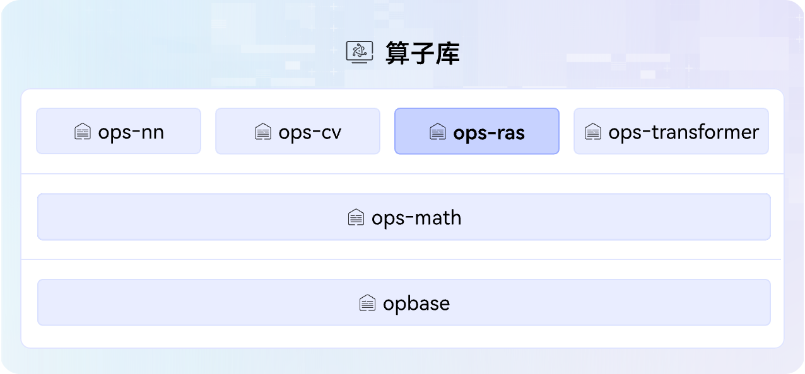

# ops-ras

简体中文 | [English](./README_en.md)

## 🔥Latest News

- [2026/07] ops-ras项目首次上线。

## 🚀概述

ops-ras是[CANN](https://hiascend.com/software/cann)（Compute Architecture for Neural Networks）算子库中的安全和维测类算子库（Reliability, Availability and Serviceability），提供可靠性、可用性和可维护性等能力，包含安全、加密以及维测相关算子，"ras"即来源于这三项核心特性的首字母缩写。算子库架构图如下：



## 📌版本配套

本项目源码会跟随CANN软件版本发布，关于CANN软件版本与本项目标签的对应关系请参阅[release仓库](https://gitcode.com/cann/release-management)中的相应版本说明。
请注意，为确保您的源码定制开发顺利进行，请选择配套的CANN版本与Gitcode标签源码，使用master分支可能存在版本不匹配的风险。

## 🛠️环境准备

[环境部署](docs/zh/install/quick_install.md)是体验本项目能力的前提，请先完成NPU驱动、CANN包安装等，确保环境正常。

## ⬇️源码下载

环境准备好后，下载与CANN版本配套的分支源码，通用命令如下，\$\{tag\_version\}替换为分支标签名。以9.0.0分支源码下载为例：

```bash
# 通用命令：git clone -b ${tag_version} https://gitcode.com/cann/ops-ras.git
git clone -b 9.0.0 https://gitcode.com/cann/ops-ras.git
```

> 说明：若环境中已存在配套分支源码，**可跳过本步骤**，例如CANNLab默认已提供最新最新版CANN对应的源码。

## 📖学习教程

- [快速入门](docs/QUICKSTART.md)：从零开始快速体验项目核心基础能力，涵盖源码编译、算子调用、开发与调试等操作。
- [进阶教程](docs/README.md)：如需深入了解项目编译部署、算子调用、开发、调试调优等能力，请查阅文档中心获取详细指引。

## 💬相关信息

- [目录结构](docs/zh/install/dir_structure.md)
- [贡献指南](CONTRIBUTING.md)
- [安全声明](SECURITY.md)
- [许可证](LICENSE)
- [所属SIG](https://gitcode.com/cann/community/tree/master/CANN/sigs/ops-basic)

-----
PS：本项目功能和文档正在持续更新和完善中，欢迎您关注最新版本。

- **问题反馈**：通过GitCode[【Issues】](https://gitcode.com/cann/ops-ras/issues)提交问题。
- **社区互动**：通过GitCode[【讨论】](https://gitcode.com/cann/ops-ras/discussions)参与交流。
- **技术专栏**：通过GitCode[【Wiki】](https://gitcode.com/cann/ops-ras/wiki)获取技术文章，如系列化教程、优秀实践等。
