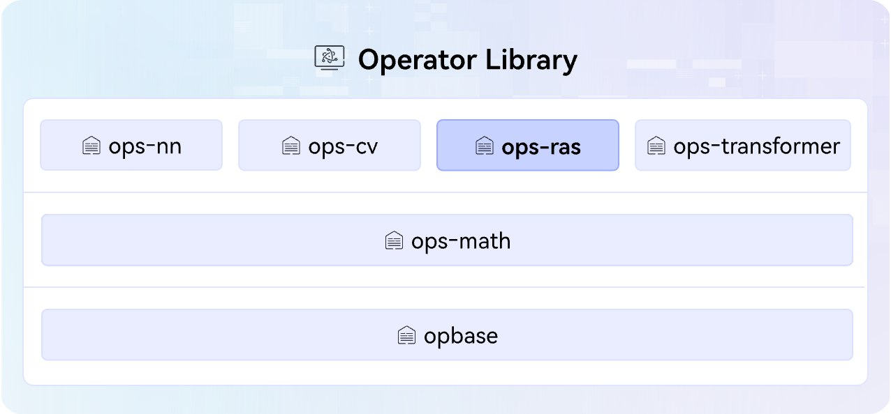

# ops-ras

English | [简体中文](./README.md)

## 🔥Latest News

- [2026/07] The ops-ras project was first released.

## 🚀Overview

ops-ras is the  RAS (Reliability, Availability and Serviceability) operator library in the [CANN](https://hiascend.com/software/cann) (Compute Architecture for Neural Networks) operator library, providing reliability, availability, and maintainability capabilities, including security, encryption, and RAS-related operators. "ras" is derived from the initials of these three core characteristics. The operator library architecture is shown below:



## 📌Version Compatibility

The source code of this project will be released along with the CANN software version. For the correspondence between CANN software versions and project tags, refer to the relevant version descriptions in the [release repository](https://gitcode.com/cann/release-management).
Note that to ensure smooth custom development of your source code, select the matching CANN version and Gitcode tag source code. Using the master branch may pose version mismatch risks.

## 🛠️Environment Setup

[Environment Deployment](docs/zh/install/quick_install.md) is the prerequisite for experiencing the capabilities of this project. Please complete the NPU driver installation, CANN package installation, and so on to ensure the environment is normal.

## ⬇️Source Code Download

After the environment is ready, download the branch source code matching the CANN version. The general command is as follows. Replace `${tag_version}` with the branch tag name. Take the 9.0.0 branch source code download as an example:

```bash
# General command: git clone -b ${tag_version} https://gitcode.com/cann/ops-ras.git
git clone -b 9.0.0 https://gitcode.com/cann/ops-ras.git
```

> Note: If the matching branch source code already exists in the environment, **you can skip this step**. For example, CANNLab provides the source code matching the latest CANN version by default.

## 📖Learning Tutorials

- [Quick Start](docs/QUICKSTART.md): Quickly experience the core basic capabilities of the project from scratch, covering source code compilation, operator invocation, development, debugging, and other operations.
- [Advanced Tutorials](docs/README.md): If you need a deeper understanding of the project's compilation and deployment, operator invocation, development, debugging and tuning, and other capabilities, please refer to the documentation center for detailed guidance.

## 💬Related Information

- [Directory Structure](docs/zh/install/dir_structure.md)
- [Contribution Guide](CONTRIBUTING.md)
- [Security Statement](SECURITY.md)
- [License](LICENSE)
- [Affiliated SIG](https://gitcode.com/cann/community/tree/master/CANN/sigs/ops-basic)

-----
PS: The functions and documentation of this project are being continuously updated and improved. We recommend that you follow the latest version.

- **Issue Feedback**: Submit issues through GitCode [Issues](https://gitcode.com/cann/ops-ras/issues).
- **Community Interaction**: Participate in discussions through GitCode [Discussions](https://gitcode.com/cann/ops-ras/discussions).
- **Technical Column**: Access technical articles through GitCode [Wiki](https://gitcode.com/cann/ops-ras/wiki), such as serialized tutorials and best practices.
