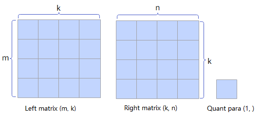
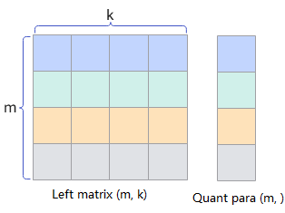
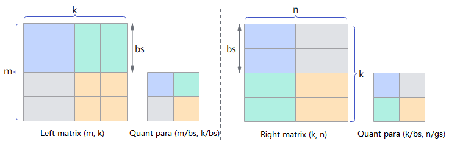

# Quantization Introduction

Quantization is widely used in deep learning models, especially during inference. Through quantization, models can run more efficiently on hardware, reducing computational resource consumption and accelerating the inference process, while also reducing the model's storage requirements.

CANN operator quantization refers to the computational process of converting the input tensors of matrix (cube) operators such as Matmul in neural networks from high-bit to low-bit representation, while generating the corresponding quantization parameter scale. After the low-bit cube computation is complete, the quantization parameter scale can convert the low-bit values back to high-bit values, thereby ensuring the correctness of the overall computation results (the effect is approximately equivalent to directly using high-bit computation) and effectively improving computational efficiency.

- Static quantization: Uses predetermined quantization parameters for quantization. In inference scenarios, the quantization of weights generally uses static quantization, which provides better operator performance.
- Dynamic quantization: Uses input data to compute quantization parameters online for quantization. In inference scenarios, the quantization of activations generally uses dynamic quantization, which better adapts to data variations and provides higher precision. In training scenarios, dynamic quantization is also generally used to improve quantization precision. Note that dynamic quantization results in slightly worse operator performance because quantization parameters are generated online.

## Quantization Modes

Quantization modes (also known as quantization granularity) refer to the use of different quantization computation levels for different input tensors of an operator. Common quantization computation modes include:

> Description:
>
> - The m, n, and k variables represent the sizes of different axes for tensor computation.
> - The left matrix and right matrix refer to the two input tensors used for matrix multiplication computation in cube operators. Generally, the left matrix represents the activation and the right matrix represents the weight. Interpret and use them according to the actual situation.

- Pertensor quantization (abbreviated as T quantization): The quantization target can be either the left matrix or the right matrix. Each tensor shares the same quantization parameter.

  Assuming the left matrix shape is (m, k) and the right matrix shape is (k, n), where k is the reduce axis, the shape of the generated quantization parameter is (1, ).

  

- Perchannel quantization (abbreviated as C quantization): The quantization target is the right matrix. Each channel uses an independent quantization parameter.

  Assuming the right matrix shape is (k, n), where k is the reduce axis, the shape of the generated quantization parameter is (n, ).

  

- Pertoken quantization (abbreviated as K quantization): The quantization target is the left matrix. Each token uses an independent quantization parameter.

  Assuming the left matrix shape is (m, k), where k is the reduce axis, the shape of the generated quantization parameter is (m, ).

  

- Pergroup quantization (abbreviated as G quantization): The quantization target can be either the left matrix or the right matrix. Data is grouped on the reduce axis, and each group uses an independent quantization parameter.
  - Assuming the left matrix shape is (m, k), where k is the reduce axis, data is grouped on the k axis with a group size of gs, and the shape of the generated quantization parameter is (m, k/gs).
  - Assuming the right matrix shape is (k, n), where k is the reduce axis, data is grouped on the k axis with a group size of gs, and the shape of the generated quantization parameter is (k/gs, n).

  

- Perblock quantization (abbreviated as B quantization): The quantization target can be either the left matrix or the right matrix. Data is divided into blocks on all axes, and each block uses an independent quantization parameter.

  - Assuming the left matrix shape is (m, k), where k is the reduce axis, data is grouped on the m and k axes by (bs, bs) blocks, where bs is the block size. The shape of the generated quantization parameter is (m/bs, k/bs).
  - Assuming the right matrix shape is (k, n), where k is the reduce axis, data is grouped on the k and n axes by (bs, bs) blocks, where bs is the block size. The shape of the generated quantization parameter is (k/bs, n/bs).

  

## Common Combined Quantization

- Full quantization: Generally refers to the mode in which both the left and right matrices are quantized, including:
  - Pertensor-perchannel quantization mode (abbreviated as T-C quantization mode)
  - Pertoken-perchannel quantization mode (abbreviated as K-C quantization mode)
  - Pergroup-perblock quantization mode (abbreviated as G-B quantization mode)
  - Pertensor-perchannel-pergroup quantization mode (abbreviated as T-CG quantization mode)
  - Perblock-perblock quantization mode (abbreviated as B-B quantization mode)
- Pseudo-quantization: Generally refers to the mode in which only the weight matrix is quantized, including the perchannel quantization mode (abbreviated as C quantization mode).
- MX quantization: Essentially Microscaling quantization, which maintains model precision at extremely low bits (such as 1 bit) by dynamically adjusting scaling factors. Here it refers to the pergroup-pergroup quantization mode (abbreviated as G-G quantization mode), which is a special case where the quantization parameter type is FLOAT8_E8M0 and the group size is 32.