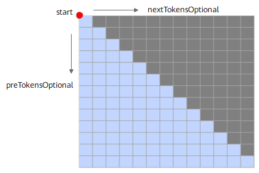
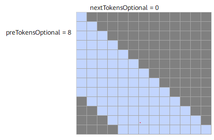
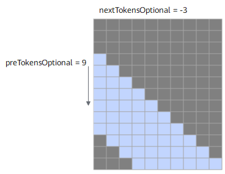
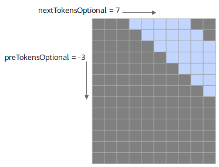
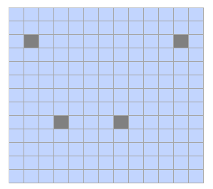
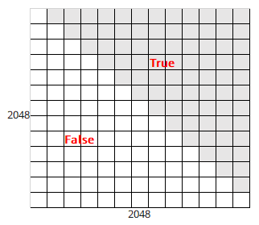
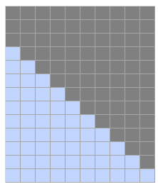
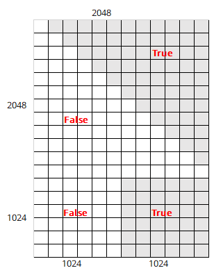
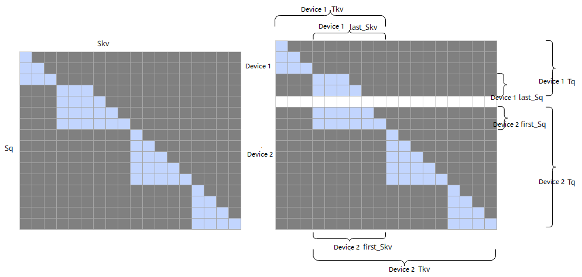

# sparseMode Introduction

In the large model field, sparseMode (sparse mode) usually refers to the sparsity design of parameters or activations in the model architecture or calculation formula, as opposed to the dense mode (DenseMode).

This section introduces common sparseModes and their corresponding scenario descriptions.

| sparseMode | Meaning                                  | Note               |
| ---------- | --------------------- | ------------------ |
| 0          | defaultMask mode.                     | -    |
| 1          | allMask mode.                         | -    |
| 2          | leftUpCausal mode.                    | -    |
| 3          | rightDownCausal mode.                 | -    |
| 4          | band mode.                            | -    |
| 5          | prefix non-compressed mode.                    | Not supported in varlen scenarios. |
| 6          | prefix compressed mode.                      | -       |
| 7          | varlen outer slice scenario, rightDownCausal mode. | Only supported in varlen scenarios. |
| 8          | varlen outer slice scenario, leftUpCausal mode.    | Only supported in varlen scenarios. |

The working principle of attenMask is to mask the value of the query (Q) and key (K) transpose matrix product at the position where Mask is True, as shown below:

The $QK^T$ matrix will be masked at the position where attenMask is True, with the following effect:

## sparseMode=0

When sparseMode is 0, it represents the defaultMask mode.

- No mask passed: If attenMask is not passed, no mask operation is performed. attenMask takes the value None, and preTokens and nextTokens values are ignored. The Masked $QK^T$ matrix is shown below:

  

- nextTokens is 0, preTokens is greater than or equal to Sq, indicating a causal scenario sparse. attenMask should pass a lower triangular matrix. At this time, the part between preTokens and nextTokens needs to be calculated. The Masked $QK^T$ matrix is shown below:

  

  attenMask should pass a lower triangular matrix, as shown below:

  

- preTokens is less than Sq, nextTokens is less than Skv, and both are greater than or equal to 0, indicating a band scenario. At this time, the part between preTokens and nextTokens needs to be calculated. The Masked $QK^T$ matrix is shown below:

  

  attenMask should pass a band-shaped matrix, as shown below:

  

- nextTokens is negative. Taking preTokens=9, nextTokens=-3 as an example, the part between preTokens and nextTokens needs to be calculated. The Masked $QK^T$ is shown below:

  **Note: When nextTokens is negative, preTokens must be greater than or equal to the absolute value of nextTokens, and the absolute value of nextTokens must be less than Skv.**

  

- preTokens is negative. Taking nextTokens=7, preTokens=-3 as an example, the part between preTokens and nextTokens needs to be calculated. The Masked $QK^T$ is shown below:

  **Note: When preTokens is negative, nextTokens must be greater than or equal to the absolute value of preTokens, and the absolute value of preTokens must be less than Sq.**

  

## sparseMode=1

When sparseMode is 1, it represents allMask, that is, passing the complete attenMask matrix.

In this scenario, nextTokens and preTokens values are ignored. The Masked $QK^T$ matrix is shown below:

## sparseMode=2

When sparseMode is 2, it represents the leftUpCausal mode mask, corresponding to the lower triangular scenario divided by the upper-left vertex (parameter starting point is the upper-left corner).

In this scenario, preTokens and nextTokens values are ignored. The Masked $QK^T$ matrix is shown below:

The passed attenMask is an optimized compressed lower triangular matrix (2048\*2048). The compressed lower triangular matrix is shown below (same below):

## sparseMode=3

When sparseMode is 3, it represents the rightDownCausal mode mask, corresponding to the lower triangular scenario divided by the lower-right vertex (parameter starting point is the lower-right corner).

In this scenario, preTokens and nextTokens values are ignored. attenMask is an optimized compressed lower triangular matrix (2048\*2048). The Masked $QK^T$ matrix is shown below:

## sparseMode=4

When sparseMode is 4, it represents the band scenario, that is, calculating the part between preTokens and nextTokens. The parameter starting point is the lower-right corner, and there must be an intersection between preTokens and nextTokens. attenMask is an optimized compressed lower triangular matrix (2048\*2048). The Masked $QK^T$ matrix is shown below:

## sparseMode=5

When sparseMode is 5, it represents the prefix non-compressed scenario, that is, adding a matrix with length Sq and width N to the left on the basis of rightDownCausal. The value of N is obtained from the optional input prefix. For example, the figure below shows prefix passing array [4,5] in batch=2 scenario. The N value of each batch axis can be different. The parameter starting point is the upper-left corner.

In this scenario, preTokens and nextTokens values are ignored. The attenMask matrix data format must be BNSS or B1SS. The Masked $QK^T$ matrix is shown below:

attenMask should pass a matrix as shown below:

## sparseMode=6

When sparseMode is 6, it represents the prefix compressed scenario, that is, in the prefix scenario, attenMask is an optimized compressed lower triangular + rectangular matrix (3072\*2048): the upper part is a [2048, 2048] lower triangular matrix, and the lower part is a [1024, 2048] rectangular matrix. The left half of the rectangular matrix is all 0, and the right half is all 1. attenMask should pass a matrix as shown below. In this scenario, preTokens and nextTokens values are ignored.

## sparseMode=7

When sparseMode is 7, it indicates a varlen and long sequence outer slice scenario (that is, long sequences are multi-card sliced by query sequence length in the model script). You need to ensure that the scenario using sparseMode 3 was used before outer slicing. In the current mode, you need to set preTokens and nextTokens (starting point is the lower-right vertex), and you need to ensure that the parameters are correct, otherwise there will be precision issues.

The Masked $QK^T$ matrix is shown below. In the second batch, the query is sliced, and the key and value are not sliced. The 4x6 mask matrix is sliced into 2x6 and 2x6 masks, which are calculated on card 1 and card 2 respectively:

- The last mask block of card 1 is a band-type mask. Configure preTokens=6 (ensure it is greater than or equal to the last Skv), nextTokens=-2. actual_seq_qlen should pass {3,5}, and actual_seq_kvlen should pass {3,9}.
- The mask type of card 2 remains unchanged after slicing. sparseMode is 3. actual_seq_qlen should pass {2,7,11}, and actual_seq_kvlen should pass {6,11,15}.

**Note**:

- sparseMode=7, band represents the sparse type of the last non-empty tensor Batch. If there is only one batch, you need to configure parameters according to the band mode requirements. For sparseMode=7, you need to input a 2048x2048 lower triangular mask as the input of this fusion operator.
- The sparse parameters of the band mode generated based on sparseMode=3 outer slicing should meet the following conditions:
  - preTokens >= last_Skv.
  - last_Sq-last_Skv <= nextTokens <= 0.
  - The current mode does not support the optional input pse.
- The non-band mode batch should satisfy: Sq <= Skv.

## sparseMode=8

When sparseMode is 8, it indicates a varlen and long sequence outer slice scenario. You need to ensure that the scenario using sparseMode 2 was used before outer slicing. In the current mode, you need to set preTokens and nextTokens (starting point is the lower-right vertex), and you need to ensure that the parameters are correct, otherwise there will be precision issues.

The Masked $QK^T$ matrix is shown below. In the second batch, the query is sliced, and the key and value are not sliced. The 5x4 mask matrix is sliced into 2x4 and 3x4 masks, which are calculated on card 1 and card 2 respectively:

- The mask type of card 1 remains unchanged after slicing. sparseMode is 2. actual_seq_qlen should pass {3,5}, and actual_seq_kvlen should pass {3,7}.
- The first mask block of card 2 is a band-type mask. Configure preTokens=4 (ensure it is greater than or equal to the first Skv), nextTokens=1. actual_seq_qlen should pass {3,8,12}, and actual_seq_kvlen should pass {4,9,13}.

**Note**:

- sparseMode=8, band represents the sparse type of the first non-empty tensor Batch. If there is only one batch, you need to configure parameters according to the band mode requirements. For sparseMode=8, you need to input a 2048x2048 lower triangular mask as the input of this fusion operator.
- The sparse parameters of the band mode generated based on sparseMode=2 outer slicing should meet the following conditions:
  - preTokens >= first_Skv.
  - nextTokens >= first_Sq - first_Skv, configure according to the actual situation.
  - The current mode does not support the optional input pse.
