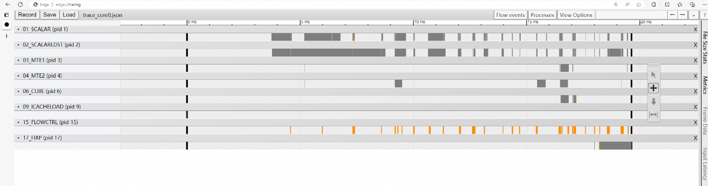

# Introduction

CANN Simulator is a SoC-level chip simulation tool designed for operator development scenarios. It analyzes the accuracy and performance data (such as instruction execution status) of AI tasks running on the AI simulator at each stage. This tool helps users perform deep performance tuning, enabling developers to obtain verification results and performance feedback nearly consistent with real chips even when real chips are unavailable or chip resources are scarce.

# Main Functions

This tool maintains binary compatibility with on-board execution (the same kernel can be executed on both the simulator and the AI processor). The main uses are as follows:

* Accuracy simulation: Outputs bit-level accuracy results, helping users complete operator accuracy verification.
* Performance simulation: Outputs instruction pipeline diagrams, helping users identify operator performance bottlenecks.

# Preparation Before Use

## Usage Constraints

* Recommended tool environment configuration: CPU with 16 cores or more, memory of 32 GB or more.
* All paths mentioned in this document must ensure that the running user has read or read-write permissions.
* For security and minimal permissions, it is recommended to use regular user permissions to execute this tool. Avoid using root or other high-privilege accounts.
* This tool depends on the CANN software package. Before using it, install the CANN software package. Driver and firmware installation is not required. Execute the CANN set_env.sh environment variable file through the source command. For security, do not modify the environment variables involved in set_env.sh after executing the source command.
* Users should follow the principle of least privilege. For example, files input to the tool must not be writable by other users. In some more stringent security scenarios, ensure that input files are not writable by group users.
* This tool is a development tool and is not recommended for use in production environments.
* The simulation function of the tool only supports single-card scenarios and cannot simulate multi-card environments. Only card 0 can be set in the code. Modifying the visible card number will cause simulation failure.
* The simulation environment only supports AI Core computation-type operators (MC2 and HCCL type operators are not supported).
* The CANN Simulator tool is currently in the early-access version stage and only supports the Ascend950PR chip. It is recommended that the simulator running environment be configured with a 16-core CPU and 32 GB or more memory.
* ARM environment simulation is not supported at this time.

## Environment Preparation

CANN Simulator is integrated in the CANN toolkit package. Complete the software package installation by following [Environment Deployment](../context/quick_install.md).

# Quick Start

The following uses [add_examples](../../../examples/add_example/) as an example to describe operator simulation in detail.

## Operator Compilation

* Complete the add_example operator compilation and installation by following [Operator Invocation](../invocation/quick_op_invocation.md).

```bash
# Note: Enter the project root directory and execute the following compilation command. The command is for reference only. For details, refer to the operator invocation instructions.
bash build.sh --pkg --soc=Ascend950 --vendor_name=custom --ops=add_example
# Install the custom operator package
./build_out/cann-ops-nn-${vendor_name}_linux-${arch}.run
```

* Complete the compilation of test_aclnn_add_example.cpp by following [aclnn Invocation](../invocation/op_invocation.md#aclnn-invocation), and generate the executable file test_aclnn_add_example.

## Execute Simulation Command

```bash
cannsim record ./test_aclnn_add_example -s Ascend950 --gen-report
```

The simulation tool execution log files are in the examples/add_example/examples/build/bin/cannsim_* directory. The execution log file is:

```bash
cannsim.log
```

From the simulation tool log file, you can see the print information in the sample:

```bash
add_example first input[0] is: 1.000000, second input[0] is: 1.000000, result[0] is: 2.000000
add_example first input[1] is: 1.000000, second input[1] is: 1.000000, result[1] is: 2.000000
add_example first input[2] is: 1.000000, second input[2] is: 1.000000, result[2] is: 2.000000
add_example first input[3] is: 1.000000, second input[3] is: 1.000000, result[3] is: 2.000000
add_example first input[4] is: 1.000000, second input[4] is: 1.000000, result[4] is: 2.000000
add_example first input[5] is: 1.000000, second input[5] is: 1.000000, result[5] is: 2.000000
add_example first input[6] is: 1.000000, second input[6] is: 1.000000, result[6] is: 2.000000
```

## View Performance Pipeline

The simulation performance pipeline files are in the `examples/add_example/examples/build/bin/cannsim_*/report` directory of this project. The pipeline-related file is:

```bash
trace_core0.json
```

Enter "chrome://tracing" in the Chrome browser and drag the generated instruction pipeline diagram file (trace_core0.json) to the blank area to open it. For specific parameter descriptions, refer to the "Simulation Result Analysis" section.

# Simulation Execution Instructions

## Command Function

Execute the application in the simulation environment.

## Command Format

cannsim record [options] user_app --user-options

## Parameter Description

Table 1 Simulation Execution Parameter Description

|Parameter|Required/Optional|Description|
| --- | --- | --- |
|-s or --soc-version [options] parameter | Required | Specify the target chip version for simulation (for example: Ascend950).|
|-o or --output [options] parameter | Optional| The path where the generated files are stored. It can be configured as an absolute path or a relative path, and the user executing the tool must have read-write permissions. If the path is not specified, data is saved in the current directory by default.|
|-g or --gen-report [options] parameter | Optional | Enable automatic analysis after simulation completion and generate an analysis report. By default, automatic analysis is not enabled.|
|user_app|Required|Operator executable file.|
|--user-options|Optional|Running parameters of the operator executable file.|

## Usage Example

1. Complete operator development and compilation.
2. Execute the simulation command. Refer to the following usage examples:

    ```text
    Method 1: Enable simulation and save the output to the ./output directory. /path/to/app is the operator program.
    $ cannsim record /path/to/app -o ./output -s Ascend950

    Method 2: Enable simulation and generate a report for subsequent performance analysis.
    $ cannsim record /path/to/app -o ./output -s Ascend950 --gen-report
    ```

3. After the command completes, a folder named "cannsim_{timestamp}_${user_app}" is generated in the default path or the specified "output" directory. The structure example is as follows:

    ```text
    ├─cannsim_{timestamp}_${user_app}
    ├── cannsim.log
    ```

4. You can obtain the operator execution results and compare the accuracy. The results are displayed in cannsim.log. An example is as follows:

    The following output is only an example of the AscendC single-operator direct invocation accuracy comparison result. It may vary slightly depending on the version. Please refer to the actual output.

    ```bash
    INFO:root:[INFO] compare data case[ case001]
    INFO:root:---------------RESULT---------------
    INFO:root:['case_name', 'wrong_num', 'total_num', 'result', 'task_duration']
    INFO:root:[' case001', 0, 65536, 'Success']
    ```

5. View the operator instruction pipeline diagram. Refer to the simulation result analysis section.

# Simulation Result Analysis Instructions

## Command Function

Generate a visualized instruction pipeline diagram.

## Command Format

cannsim report [options]

## Parameter Description

Table 1 Simulation Result Analysis Parameter Description

|Parameter | Required/Optional | Description|
| --- | --- | --- |
|-e  or --export  [options] parameter | Required | The original result file directory. It must be specified as the result directory generated after simulation execution, pointing to the cannsim_{timestamp}_${user_app} level. It can be configured as an absolute path or a relative path, and the tool execution user must have read-write permissions.|
|-o or --output [options] parameter | Optional | The analysis result output directory. It can be configured as an absolute path or a relative path, and the execution user must have read-write permissions. If the path is not specified, data is saved in the current directory by default. If the generated result file has the same name as an existing file, the existing file is overwritten.|
|-n or --core-id [options] parameter | Optional | Specify the core ID for generating the instruction pipeline. If not specified, the pipeline for core 0 is generated by default. The configuration format is as follows: To generate pipelines for all cores, configure 'all'. To specify a core ID range, for example: '0-1'. To specify a single core ID, for example: '5'.|

## Usage Example

1. Execute operator simulation by following the simulation execution instructions, and compare the output example to ensure the corresponding results are correct.
2. Execute the simulation result analysis command. Refer to the following execution example.

    ```bash
    Generate a performance analysis report in the current directory (default: analyze only core 0)
    cannsim report -e /path/to/cannsim_{timestamp}_${user_app}

    Generate performance analysis reports for core 0, core 1, core 11, and core 12 in the specified directory
    cannsim report -e /path/to/cannsim_{timestamp}_${user_app} -o /path/to/report -n '0-1, 11-12'
    ```

3. After the command execution completes, the corresponding pipeline files are generated in the output configured directory. The file format is JSON. The output result example is as follows:

    ```bash
    trace_core0.json
    trace_core1.json
    ...
    ```

4. View simulation results
    Enter "chrome://tracing" in the Chrome browser and drag the generated instruction pipeline diagram file (trace.json) to the blank area to open it. Use keyboard shortcuts (W: zoom in, S: zoom out, A: move left, D: move right) to view the results.
    

    Table 2 Key Field Description

    |Field Name|Field Meaning|
    | --- | --- |
    |VECTOR|Vector computation unit.|
    |SCALAR|Scalar computation unit.|
    |Cube|Matrix multiplication computation unit.|
    |MTE1|Data transfer pipeline; data transfer direction: L1 ->{L0A/L0B, UBUF}.|
    |MTE2|Data transfer pipeline; data transfer direction: {DDR/GM, L2} ->{L1, L0A/B, UBUF}.|
    |MTE3|Data transfer pipeline; data transfer direction: UBUF -> {DDR/GM, L2, L1}, L1->{DDR/L2}.|
    |FIXP|Data transfer pipeline; data transfer direction: FIXPIPE L0C -> OUT/L1.|
    |FLOWCTRL|Control flow instruction.|
    |ICACHELOAD|View ICache misses.|

# Query Help Information

## Command Function

Query tool help information.

## Command Format

Query tool help information:

```bash
cannsim --help
```

Query tool record subcommand help information:

```bash
cannsim record --help
```

Query tool report subcommand help information:

```bash
cannsim report --help
```

## Parameter Description

None

## Usage Example

1. Log in to the Host-side server.
2. Execute the following command.

    ```bash
    cannsim --help
    ```

## Output Description

```bash
usage: cannsim [-h] {record,report} ...

Command-line tool for performance simulation analysis on Ascend hardware.

positional arguments:
  {record,report}  Available commands
    record         Run user application in AscendOps simulation environment
    report         Generate performance analysis reports

options:
  -h, --help       show this help message and exit
```
