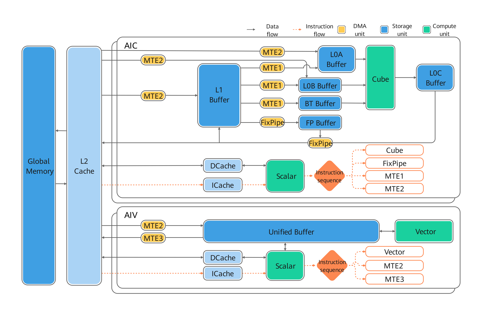
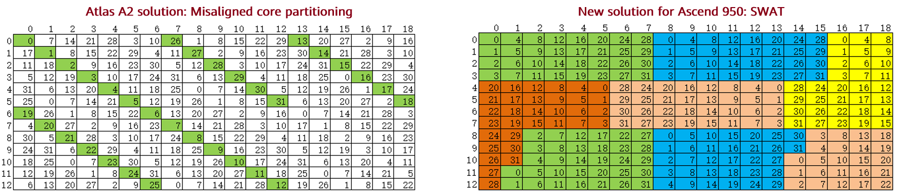
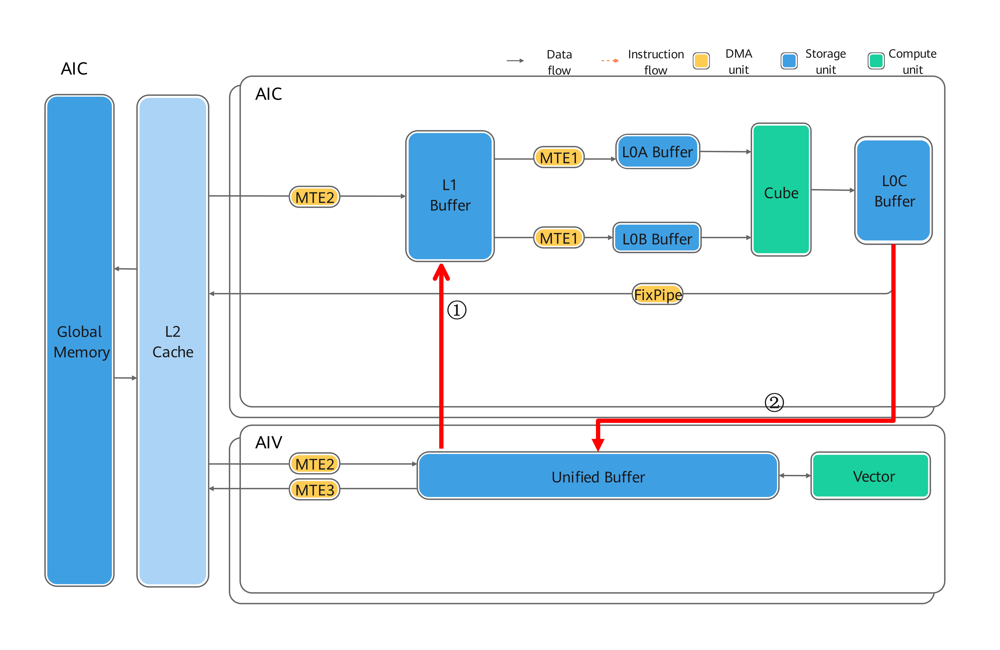

# Cross-Platform Migration Guide for Operators

This guide describes the key adaptation points and solutions for migrating operators across multiple platforms. Taking the migration of operators from the Atlas A2 series to the Ascend 950 series as an example, it compares hardware architecture differences and related adaptation points, and provides relevant operator adaptation samples.

## I. Hardware Architecture and Specification Parameter Comparison

### Atlas A2 Series Hardware Architecture

<div align="center">
  
</div>

### Ascend 950 Series Hardware Architecture

<div align="center">
  
</div>

### Intergenerational Specification Parameter Comparison

Multiple product models are typically divided based on different application scenarios, processes, or hardware configurations. Each model may have certain differences in performance, resource configuration, and other aspects. For ease of explanation and direct comparison, this section selects representative configurations as parameter display and difference analysis objects. For other related adjustments, refer to the actual manual or official release.

<table>
  <tr>
    <th colspan="2" style="width: 25%;">Specification Item</th>
    <th style="width:37.5%;">Atlas A2</th>
    <th style="width:37.5%;">Ascend 950</th>
  </tr>
  <tr>
    <td rowspan="4">AICore</td>
    <td>Core Count</td>
    <td>24</td>
    <td>32</td>
  </tr>
  <tr>
    <td>Frequency</td>
    <td>1.8</td>
    <td>1.65</td>
  </tr>
  <tr>
    <td>Cube Computing Power</td>
    <td>353T/376T @BF16,FP16</td>
    <td>426T@BF16,FP16 757T@FP8,HIFP8,MXFP8,INT8 1514T@MXFP4</td>
  </tr>
  <tr>
    <td>Vector Computing Power (FP16)</td>
    <td>23.5T</td>
    <td>54T</td>
  </tr>
  <tr>
    <td rowspan="2">Memory</td>
    <td>Memory Capacity (GB)</td>
    <td>64</td>
    <td>128</td>
  </tr>
  <tr>
    <td>Memory Bandwidth</td>
    <td>1.6TB/s</td>
    <td>1.6TB/s</td>
  </tr>
</table>

## II. Adaptation Points Introduced by Hardware Capability Changes

<table>
  <tr>
    <th style="width: 25%;">Hardware Unit</th>
    <th style="width:35%;">Hardware Capability Change</th>
    <th style="width:40%;">Typical Impact Scope</th>
  </tr>
  <tr>
    <td rowspan="5">Data Transfer Unit</td>
    <td>Removed the data path from L1 to GM</td>
    <td>Kernels that rely on L1 directly writing back to GM must be changed to use the L1 to UB to GM or L0C/FIXPIPE to GM path. Related DataCopy links, event synchronization, and buffer planning need to be adjusted.</td>
  </tr>
  <tr>
    <td>Removed the data paths from GM to L0A and L0B</td>
    <td>The direct GM to L0A/L0B connection is no longer available. Use GM to L1 to L0A/L0B instead. The L1 tiling strategy and MTE1/MTE2 pipelines need to be restructured.</td>
  </tr>
  <tr>
    <td>ND DMA flexible data transfer, supporting in-line ND to NZ conversion</td>
    <td>ND2NZ/DN2NZ can be used to complete format conversion during the MTE2 stage, reducing intermediate buffers and format conversion overhead. Pay attention to stride, alignment, and NZ shape mapping.</td>
  </tr>
  <tr>
    <td>Supports efficient Cube-to-Vector internal data paths: L1 to UB, L0C to UB, FIXP to UB</td>
    <td>Intermediate accumulation/activation/fusion (such as K-split accumulation and post-processing) can be performed on the UB side, reducing GM round trips. The corresponding synchronization and pipeline partitioning need to be adjusted.</td>
  </tr>
  <tr>
    <td>Introduced the collective communication accelerator CCU1.0</td>
    <td>For communication-computation fusion operators, adjust HcclServerType in Eager mode, and switch to the CCU series GE interfaces in Graph mode.</td>
  </tr>
  <tr>
    <td rowspan="3">Compute Unit</td>
    <td>Vector now supports the Regbase paradigm</td>
    <td>The memory access patterns, alignment methods, and register count assumptions that originally relied on Membase need to be re-examined. Templates and tiling may need to be updated to the Regbase version.</td>
  </tr>
  <tr>
    <td>Cube no longer supports int4_t</td>
    <td>All operators using int4_t need to switch to supported data types (such as int8) and update the quantization calculation logic.</td>
  </tr>
  <tr>
    <td>4:2 sparse matrix computation is not supported</td>
    <td>Kernels that originally relied on the 4:2 sparse feature for acceleration need to be changed to dense or other supported sparse strategies, and the performance expectation description needs to be updated.</td>
  </tr>
  <tr>
    <td rowspan="1">Storage Unit</td>
    <td>Local Buffer memory improvements: Cube L0C 256 KB, Vector UB 256 KB</td>
    <td>Larger L0C/UB allows for increasing the basic block size and double buffering capacity, reducing the number of K-split and block-split rounds. The L1/L0/UB ratio and tile size need to be re-evaluated.</td>
  </tr>
  <tr>
    <td rowspan="2">Other</td>
    <td>Performance optimization for multiple cores simultaneously accessing the same Global Memory address</td>
    <td>Templates related to matrix multiplication operators can be optimized.</td>
  </tr>
  <tr>
    <td>SIMT</td>
    <td>With the introduction of SIMT, thread-level parallelism can be used to handle branching and irregular computation, but it requires adaptation of thread partitioning, shared memory, and synchronization semantics. Some Vector implementations can be migrated to SIMT versions.</td>
  </tr>
</table>

## III. Recommended Migration Steps

1. Confirm whether the compute units (Cube/Vector) involved in the operator and the supported data types of the corresponding units differ between platforms.
2. Confirm whether the data transfer units involved (ND-to-NZ, GM-to-Lx, collective communication, and so on) differ between platforms.
3. Modify item by item according to the hardware capability change points (Vector architecture, Cube supported data types, L1/L0/UB size, CCU communication, and so on).
4. Refer to the operator migration samples to adjust or supplement the Atlas A2/Ascend 950 branching logic.

## IV. Operator Migration Samples

### Cube Matrix Computation Operators

#### Global Memory Same-Address Access Conflict Optimization

The Ascend 950 hardware introduces a new feature for parallel processing of same-address requests, eliminating the need to specifically avoid same-address access conflicts in various multi-core scenarios. During migration, the multi-core strategy designed for "offset-based conflict avoidance" on Atlas A2 can be simplified to a more regular sliding window template (such as row-group windowing with column-wise back-and-forth scanning), reducing invalid offsets and redundant address transformations. In practice, it is recommended to first retain the original tile size with the goal of functional equivalence, and then gradually relax the multi-core constraints. Observe key metrics such as MAC utilization, MTE2 utilization, and L2 hit rate based on profiling data to confirm whether the template adjustment brings stable benefits.

<div align="center">
  
</div>

#### Tile Size Adjustment

On Atlas A2, the L0C size is 128 KB, while on Ascend 950 it is increased to 256 KB. This means that a single instance can carry a larger accumulation result block. During migration, prioritize increasing the tile block partitioning granularity or the single-round processing depth in the K direction to reduce the number of block and K-split rounds, thereby reducing loop control and data transfer overhead. At the same time, rebalance the L1/L0/UB capacity budget to avoid pipeline breakpoints caused by L0C expansion squeezing A/B/scale buffering.

### Vector Computation Operators

#### SIMT

The Ascend 950 series introduces a new SIMT unit. SIMT has significant advantages over SIMD in handling irregular discrete access, and is suitable for scenarios with discontinuous addresses, large variations in memory access span, and inconsistent branch paths (such as scatter/gather, index reordering, and sparse updates).

During migration, it is recommended to prioritize identifying operator sub-processes that are "memory-access-dominated" and have "low vectorization efficiency." If the original SIMD implementation has a large number of mask branches, a high proportion of invalid lanes, or requires complex address assembly, that part can be rewritten to the SIMT path, which typically reduces control overhead and improves effective memory access throughput.

In practice, focus on the following points: first, the thread task partitioning must match the data sparsity to avoid extremely unbalanced thread loads; second, reduce pipeline idle time caused by high-frequency random memory access, and try to complete index regularization and bucketing upstream; third, decouple boundary processing from the main path to avoid introducing too many branches in hot loops. After migration, it is recommended to compare the "pure SIMD implementation" and the "SIMD + SIMT hybrid implementation" and select the optimal strategy based on data distribution, rather than fixing a single path.

**Taking the gather_v2 operator as an example: SIMD vs. SIMT implementation comparison**

The gather_v2 operator performs gather based on the last axis after axis merging. Therefore, the template selection basis is: use the SIMT template when the last axis is less than or equal to 2048, and use the SIMD template when the last axis is greater than 2048. This is because when the last axis is small, multiple discontinuous small block addresses need to be accessed discretely, and SIMT is more efficient. The following compares the core differences between the two implementations:

**1. Programming Model Differences**

The SIMD implementation uses the traditional vectorized programming model, requiring explicit management of UB buffers and pipeline queues:

```cpp
// SIMD: Uses queue mechanism to manage data buffering
TQueBind<QuePosition::VECIN, QuePosition::VECOUT, BUFFER_NUM> inQueue_;
TBuf<QuePosition::VECCALC> indexBuf_;

// SIMD: Row-by-row processing, explicit data transfer and synchronization
for (int64_t j = 0; j < rows; j++) {
    INDICES_T index = GetIndex(yIdx, indiceEndIdx);  // Scalar index read
    int64_t xIndex = index * tilingData_->innerSize;
    DataCopyPad(xLocal[j * colsAlign], xGm[offset], dataCoptExtParams, dataCopyPadExtParams); // Batch continuous data transfer in
}
inQueue_.EnQue<int8_t>(xLocal);  // Enqueue for output
```

The SIMT implementation uses a thread-level parallelism model, where each thread independently processes elements:

```cpp
// SIMT: Uses thread-level parallelism, no explicit buffer management required
__simt_vf__ LAUNCH_BOUND(2048) void GatherSimt(...) {
    for (INDEX_SIZE_T index = Simt::GetThreadIdx();
         index < currentCoreElements;
         index += Simt::GetThreadNum()) {  // Thread jump-style parallelism
        // Each thread independently computes a single-point index and accesses memory
        INDEX_SIZE_T gatherI = Simt::UintDiv(yIndex, m0, shift0);
        INDICES_T indicesValue = indices[gatherI];  // Directly access GM based on the single-point index gatherI
        y[yIndex] = idxOutOfBound ? 0 : x[xIndex];  // Directly write back to GM
    }
}
```

**2. Memory Access Pattern Differences**

| Feature | SIMD Implementation | SIMT Implementation |
|------|----------|----------|
| Data Access | Explicit data transfer to UB through DataCopyPad | Threads directly access GM through `__gm__` pointers |
| Buffer Management | AllocTensor/EnQue/DeQue/FreeTensor required | No explicit buffer required; hardware manages automatically |
| Synchronization Mechanism | Explicit event synchronization (HardEvent::MTE2_V, etc.) | Implicit synchronization between threads |

**3. Applicable Scenario Differences**

SIMD is suitable for scenarios with continuous access to large blocks of addresses, efficiently processing continuous data through vectorized instructions.

SIMT is suitable for discrete memory access, with threads processing in parallel.

#### Regbase

The Ascend 950 series introduces the Regbase programming paradigm. Compared with the traditional Membase (Vector API) programming, Regbase is closer to the underlying hardware register operations and provides finer-grained vectorization control capabilities.

**Features**

- Uses the underlying APIs under the `AscendC::MicroAPI` namespace
- Directly operates on registers `RegTensor<T>` instead of explicitly managing UB buffer queues
- Implements flexible element-level mask control through `MaskReg`

**Comparison with the Membase Programming Model**

| Feature | Membase (Traditional Vector API) | Regbase (MicroAPI) |
|------|---------------------------|---------------------|
| Data Carrier | `LocalTensor<T>` + Queue mechanism | `RegTensor<T>` register |
| Memory Management | Explicit Alloc/EnQue/DeQue/Free | Register auto-allocation |
| Mask Control | Function parameter control | `MaskReg` register control |
| Data Transfer | `DataCopy`/`DataCopyPad` | `MicroAPI::DataCopy` + distribution mode |

**Code Examples**

```cpp
__simd_vf__ __aicore__ void GenIndexBuf(ubuf int32_t* helpAddr, int32_t colFactor)
{
    // Declare register tensors
    AscendC::MicroAPI::RegTensor<int32_t> v0;
    AscendC::MicroAPI::RegTensor<int32_t> v1;
    AscendC::MicroAPI::RegTensor<int32_t> vd1;

    // Create a full mask
    AscendC::MicroAPI::MaskReg preg =
        AscendC::MicroAPI::CreateMask<int32_t, AscendC::MicroAPI::MaskPattern::ALL>();

    // Duplicate scalar to register
    AscendC::MicroAPI::Duplicate(v1, colFactor, preg);
    // Generate sequence [0, 1, 2, ...]
    AscendC::MicroAPI::Arange(v0, 0);
    // Vector operations
    AscendC::MicroAPI::Div(vd1, v0, v1, preg);
    AscendC::MicroAPI::Mul(vd2, vd1, v1, preg);
    AscendC::MicroAPI::Sub(vd3, v0, vd2, preg);
    // Write register data back to UB
    AscendC::MicroAPI::DataCopy(helpAddr, vd3, preg);
}
```

```cpp
// Dynamic mask: Handle tail incomplete data
__simd_vf__ __aicore__ void GatherProcess(ubuf int8_t* curYAddr, uint16_t repeatimes, uint16_t computeSize)
{
    MicroAPI::RegTensor<int8_t> vregTemp;
    MicroAPI::MaskReg preg;

    for (uint16_t r = 0; r < repeatTimes; r++) {
        // Update mask based on the number of remaining elements
        preg = MicroAPI::UpdateMask<int8_t>(sreg);
        // Create an address offset register
        MicroAPI::AddrReg offset = MicroAPI::CreateAddrReg<int8_t>(r, computeSize);
        MicroAPI::DataCopy(vregTemp, curXAddr, offset);
        // Store data with mask
        MicroAPI::DataCopy(curYAddr, vregTemp, offset, preg);
    }
}
```

```cpp
// Data aggregation
__VEC_SCOPE__
{
    MicroAPI::RegTensor<uint32_t> indicesReg;
    MicroAPI::RegTensor<int32_t> vd0;

    for (uint16_t indices = 0; indices < indicesLoopNum; indices++) {
        // Load indices (E2B distribution mode: broadcast scalar to vector)
        MicroAPI::DataCopy<uint32_t, MicroAPI::LoadDist::DIST_E2B_B32>(indicesReg, indicesAddr);
        // Gather data aggregation based on indices
        MicroAPI::DataCopyGather(vd0, curXAddr, indicesReg, preg);
        // Data block copy output
        MicroAPI::DataCopy<int32_t, MicroAPI::DataCopyMode::DATA_BLOCK_COPY>(
            curYAddr, vd0, blockStride, preg);
    }
}
```

**Key Regbase API Descriptions**

| API Category | API Name | Function Description |
|---------|---------|----------|
| Register Type | `RegTensor<T>` | Vector register tensor type |
| Mask Type | `MaskReg` | Mask register type |
| Mask Creation | `CreateMask<T, Pattern>()` | Create a mask (ALL/HALF and other patterns) |
| Mask Update | `UpdateMask<T>(count)` | Dynamically update the mask based on the number of remaining elements |
| Scalar Operation | `Duplicate(reg, val, mask)` | Duplicate a scalar value to all elements of a register |
| Sequence Generation | `Arange(reg, start)` | Generate a continuous sequence |
| Arithmetic Operations | `Add/Sub/Mul/Div(dst, src1, src2, mask)` | Vector arithmetic operations |
| Scalar Operations | `Adds/Muls(dst, src, scalar, mask)` | Vector and scalar operations |
| Type Conversion | `Cast<DT, ST>(dst, src, mask)` | Data type conversion |
| Comparison Operations | `Compare<T, CMPMODE>(mask, src1, src2, pred)` | Vector comparison generates a mask |
| Data Load | `DataCopy<T, LoadDist>(reg, addr)` | Load from UB to register |
| Data Store | `DataCopy<T>(addr, reg, mask)` | Store from register to UB |
| Gather | `DataCopyGather(dst, base, indices, mask)` | Collect data based on indices |
| Address Offset | `CreateAddrReg<T>(loop, stride)` | Create a loop address offset register |

**LoadDist (Distribution Mode) Descriptions**

| Mode | Description | Typical Use |
|------|------|----------|
| `DIST_NORM` | Normal continuous load | Continuous data processing |
| `DIST_UNPACK_B16` | 16-bit unpack load | FP16/BF16 to FP32 conversion |
| `DIST_BRC_B32/B16` | Broadcast load | Scalar scale broadcast |
| `DIST_E2B_B32` | Scalar to vector broadcast | Index value broadcast |

**Migration Suggestions**

1. Scenarios suitable for Regbase: Cases requiring fine-grained control of register allocation, complex mask logic, and Gather/Scatter memory access patterns.
2. Scenarios to retain Membase: Simple continuous data transfer and computation, double-buffered pipelines.
3. Hybrid use: Combine both paradigms within the same operator, using Regbase to handle core computation logic and Membase to manage data transfer.

### Cube-Vector Fusion Operators

#### MTE Data Transfer Path Changes

The Ascend 950 new architecture introduces direct connection paths between UB-to-L1 and L0C-to-UB, enabling fast transfer of matrix computation data. This aims to simplify CV fusion operator development and improve performance.
<div align="center">
  
</div>

**Matrix Move-In**

Enable the UB-to-L1 (UB2L1) direct connection path. Through the DataCopy interface, the vector computation results of fusion operators can be directly moved into L1.

**Matrix Move-Out**

Enable the L0C-to-UB (L0C2UB) direct connection path. Through the DataCopy interface, the matrix computation results of fusion operators can be directly moved into UB for subsequent vector computation.

For K-split or multi-stage fusion scenarios, the "L0C moved back to GM and then read back to UB" approach can be changed to "L0C directly to UB for accumulation/post-processing," reducing GM round-trip bandwidth pressure and latency. During migration, it is recommended to place intermediate result merging and activation/quantization pre-processing on the UB side, and explicitly sort out the event synchronization order of MTE1/MTE2/MTE3 and compute units to ensure continuous cross-unit pipelines, avoiding data visibility or synchronization timing issues introduced by the new paths. For the key enabling interface definitions, refer to:

```cpp
// 1. New: The move-in interface adds UB2L1 Nd2Nz move-in, supporting the form where both Src and Dst are LocalTensor
template <typename T>
__aicore__ inline void DataCopy(const LocalTensor<T>& dst, const LocalTensor<T>& src, const Nd2NzParams& intriParams);

// 2. New: The move-out interface adds L0C2UB move-out, supporting direct move-out from L0C to UB, supporting the form where both Src and Dst are LocalTensor
template <typename T, typename U, const FixpipeConfig& config = CFG_ROW_MAJOR>
__aicore__ inline void Fixpipe(const LocalTensor<T>& dst, const LocalTensor<U>& src, const FixpipeParamsC310<config.format>& intriParams);
template <CO2Layout format = CO2Layout::ROW_MAJOR>
struct FixpipeParamsC310 {
    // ...
    uint8_t dualDstCtl = 0;
};

// 3. Capability enhancement: The cross-core synchronization interface adds mode 3
template <uint8_t modeId, pipe_t pipe>
__aicore__ inline void CrossCoreSetFlag(uint16_t flagId)
template <uint8_t modeId = 0, pipe_t pipe = PIPE_S>
__aicore__ inline void CrossCoreWaitFlag(uint16_t flagId)

```

#### Cross-Core Synchronization Semaphore Matching

`CrossCoreSetFlag` and `CrossCoreWaitFlag` are cross-core synchronization semaphore interfaces, widely used for data dependency and collaborative control between multiple cores. They essentially decouple and orderly advance data processing stages between different AICores in the form of "semaphores," and are commonly used in scenarios such as pipeline control, double-buffer switching, and cross-core collaboration.

- `CrossCoreSetFlag`: After the current core (or thread) completes data processing for a certain stage, it actively sets the specified flag signal to inform the dependent party (generally another core or downstream pipeline stage) that this stage is complete and the subsequent process can continue.
- `CrossCoreWaitFlag`: The current core (or thread) needs to wait for a certain flag signal to be set (that is, the dependent data or event is complete). After detecting the flag, it continues to execute downward.

The essence of this semaphore mechanism is to ensure a consistent synchronization sequence between multiple threads or pipeline stages, preventing hardware exceptions such as data races or deadlocks caused by resources not being ready or dependencies not being completed. For detailed interface descriptions, refer to the official documentation: [CrossCoreSetFlag and CrossCoreWaitFlag Cross-Core Synchronization Interface Details](https://www.hiascend.com/document/detail/zh/CANNCommunityEdition/900beta1/API/ascendcopapi/atlasascendc_api_07_0273.html).

On Ascend 950, the numbers of `CrossCoreWaitFlag` and `CrossCoreSetFlag` must strictly match, and it is recommended to design them in pairs within the same synchronization semantic domain, following the "produce first, then consume" order. On Atlas A2, if there are redundant `CrossCoreSetFlag` semaphores between operators, HWTS performs special handling to clear the counter. The Ascend 950 series, to reduce hardware overhead, no longer relies on this type of fallback mechanism, requiring that the synchronization semaphores within a single operator kernel match one-to-one. Otherwise, a deterministic hang will occur.

During migration, focus on troubleshooting the following issues: first, abnormal branch early returns that cause only `Set` to be executed without the corresponding `Wait` (or vice versa); second, multi-stage pipelines reusing the same `flagId` but with overlapping lifecycles, causing "cross-stage crosstalk"; third, conditionally triggered synchronization within loops but with unaligned loop boundaries, resulting in inconsistent iteration counts. The above issues may be masked on Atlas A2 but directly exposed as blocking timeouts or deadlocks on Ascend 950. For operators with complex cross-core pipelines, first build a minimal dataset for single-stage verification, and then gradually add double buffering and multiple stages to reduce the complexity of locating synchronization issues.

### Collective Communication Operators

Ascend 950 introduces the collective communication accelerator CCU1.0, which reduces memory access requirements and scheduling latency. To effectively utilize this feature, the cross-chip communication method of operators is changed from AICPU on A2 to CCU communication.

**Eager Mode**

In the second-stage interface of the aclnn two-phase interface, specify the collective communication type for the operator executor aclOpExecutor.

Taking the [MatmulAllReduce](https://gitcode.com/cann/ops-transformer/tree/master/mc2/matmul_all_reduce) operator migration as an example:
Set the NnopbaseSetHcclServerType enum value. For A2, it is NNOPBASE_HCCL_SERVER_AICPU, and for 950, it is NNOPBASE_HCCL_SERVER_TYPE_CCU.

```CPP
// ...
aclnnStatus aclnnMatmulAllReduce(
    void* workspace, uint64_t workspaceSize, aclOpExecutor* executor, const aclrtStream stream)
{
    // ...
    if (NnopbaseSetHcclServerType) {
        if (op::GetCurrentPlatformInfo().GetCurNpuArch() == NpuArch::DAV_3510) {
            NnopbaseSetHcclServerType(executor, NnopbaseHcclServerType::NNOPBASE_HCCL_SERVER_TYPE_CCU);
        }
    }
    // ...
    return ACLNN_SUCCESS;
}
```

**Graph Mode**

1. In the CalcParamFunc callback interface used for resource computation and application, which involves auxiliary stream-related information, differentiate the collective communication type of the auxiliary stream for the GE context context.
2. In the GenerateTask callback interface used for setting custom tasks and parameter customization on the main stream and auxiliary streams, differentiate between the two sets of GE KernelLaunch interfaces, and call the AICPU communication or CCU communication creation and customization processes respectively.

For the static graph GE side, the task type for creating communication tasks is aicpu kfc server + kfc_stream for A2, and ccu server + ccu_stream for 950. The related code file is: [matmul_all_reduce_gen_task.cpp](https://gitcode.com/cann/ops-transformer/blob/master/mc2/matmul_all_reduce/op_graph/matmul_all_reduce_gen_task.cpp)

```CPP
// ...
ge::Status MatmulAllReduceCalcParamFunc(gert::ExeResGenerationContext *context)
{
    if (Mc2GenTaskOpsUtils::IsTargetPlatformNpuArch(context->GetNodeName(), NPUARCH_A5)) {
        // 950
        return Mc2GenTaskOpsUtils::CommonKFCMc2CalcParamFunc(context, "ccu server", "ccu_stream");
    }
    // A2
    return Mc2GenTaskOpsUtils::CommonKFCMc2CalcParamFunc(context, "aicpu kfc server", "kfc_stream");
}
// ...
```

The static graph GenTask invocation interfaces differ, and the processes are different. The related code file is: [matmul_all_reduce_gen_task.cpp](https://gitcode.com/cann/ops-transformer/blob/master/mc2/matmul_all_reduce/op_graph/matmul_all_reduce_gen_task.cpp)

```CPP
// ...
// A2
ge::Status MatmulAllReduceGenTaskOpsUtils::MatmulAllReduceGenTaskCallback(
    const gert::ExeResGenerationContext *context, std::vector<std::vector<uint8_t>>& tasks) {
    // ...
    // aicpu task
    ge::KernelLaunchInfo aicpu_task =
        ge::KernelLaunchInfo::CreateAicpuKfcTask(context, SO_NAME.c_str(), KERNEL_NAME_V1.c_str());
    // ...
}

// 950
ge::Status Mc2Arch35GenTaskOpsUtils::Mc2Arch35GenTaskCallBack(const gert::ExeResGenerationContext *context, std::vector<std::vector<uint8_t>> &tasks) {
    // ...
    // ccu task
    ge::KernelLaunchInfo ccuTask = ge::KernelLaunchInfo::CreateCcuTask(context, ccuGroups);
    // ...
}

ge::Status MatmulAllReduceGenTaskFunc(const gert::ExeResGenerationContext *context, std::vector<std::vector<uint8_t>> &tasks)
{
    if (Mc2GenTaskOpsUtils::IsTargetPlatformNpuArch(context->GetNodeName(), NPUARCH_A5)) {
        // 950
        return Mc2Arch35GenTaskOpsUtils::Mc2Arch35GenTaskCallBack(context, tasks);
    }
    // A2
    return MatmulAllReduceGenTaskOpsUtils::MatmulAllReduceGenTaskCallback(context, tasks);
}
// ...
```

## V. Common Issues and Performance Tuning Suggestions (FAQ/Performance Tips)

If the performance of an operator on Ascend 950 does not improve but declines, prioritize the following checks:

1. Whether the Atlas A2 offset-based multi-core template is still being used.
2. Whether CCU communication is not enabled and AICPU is still being used.
3. Whether the tiling still uses the Atlas A2 L1/L0/UB partitioning strategy, resulting in the larger on-chip cache of Ascend 950 not being fully utilized.