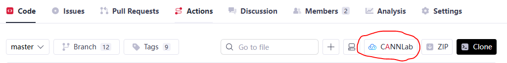

# Environment Deployment

Before performing [operator invocation](../invocation/quick_op_invocation.md) or [operator development](../develop/aicore_develop_guide.md) based on this project, complete the basic environment setup by following the steps below.

Note that the meanings of compilation and runtime scenarios mentioned in this document are as follows. Install as needed:

- Compilation scenario: For scenarios where only compilation without running this project is required, you only need to install the prerequisite dependencies and the CANN toolkit package.
- Runtime scenario: For scenarios where this project is run (compilation and running or pure running), in addition to installing the prerequisite dependencies and the CANN toolkit package, you also need to install the driver and firmware, and the CANN ops package.

## Prerequisites

Before using this project, ensure that the following basic dependencies, NPU driver, and firmware are installed.

1. **Install Dependencies**

   The dependencies used for source code compilation of this project are as follows. Please note the version requirements.

   - python >= 3.7.0 (recommended version <= 3.10)
   - gcc >= 7.3.0
   - cmake >= 3.16.0
   - pigz (optional, installing it can improve packaging speed, recommended version >= 2.4)
   - dos2unix
   - gawk
   - make

   The above dependency packages can be installed through the install\_deps.sh script in the project root directory. The command is as follows. If you encounter an unsupported system, refer to the file to adapt it yourself.

   ```bash
   bash install_deps.sh
   ```

2. **Install Driver and Firmware (Runtime Dependency)**

   When running operators, you must install the driver and firmware. If you are only compiling operators, you can skip this operation.

   Click [download link](https://www.hiascend.com/hardware/firmware-drivers/community) to obtain the corresponding `Ascend-hdk-<chip_type>-npu-driver_<version>_linux-<arch>.run` and `Ascend-hdk-<chip_type>-npu-firmware_<version>.run` packages according to the actual product model and environment architecture.

   For installation instructions, refer to [CANN Software Installation Guide](https://www.hiascend.com/document/detail/en/CANNCommunityEdition/latest/softwareinst/instg/instg_0000.html?OS=openEuler&InstallType=netyum).

## Environment Preparation (Choose One of Three)

This project provides multiple ways to deploy CANN packages. Choose as needed.

- WebIDE and Docker environment: Provides minimal environment setup, **default installation of the latest commercial release CANN software package** (currently CANN 8.5.0).
- Manual installation of CANN package: If you want to experience manual installation of CANN package or experience the latest master branch capabilities, manual installation is recommended.

### Using WebIDE Environment

For users without an environment, you can directly use the WebIDE development platform, that is, the "**Operator One-stop Development Platform**". This platform provides an online Ascend environment that can be run directly. The environment has installed the necessary software packages, and no manual installation is required. For more information about the development platform, refer to [LINK](https://gitcode.com/org/cann/discussions/54).

1. Enter the open source project and click the "`Cloud Development`" button. Log in with a certified Huawei Cloud account. If you have not registered or certified, please register and certify according to the page prompts.

    

2. Create and start the cloud development environment according to the page prompts. Click "`Connect > WebIDE`" to enter the operator one-stop development platform. The resources of the open source project are in the `/mnt/workspace` directory by default.

   

### Using Docker Deployment

> **Note:**
>
> - Docker image is an efficient deployment method. Currently, it is only applicable to Atlas A2 series products and only adapted to the Ubuntu operating system.
> - The image file is relatively large, and downloading takes some time. Please wait patiently.

#### 1. Download Image

1. Log in to the host machine as the root user. Ensure that the Docker engine (version 1.11.2 or above) is installed on the host machine.
2. Pull the image with the CANN software package and `ops-nn` required dependencies pre-integrated from the [Ascend Image Repository](https://www.hiascend.com/developer/ascendhub/detail/17da20d1c2b6493cb38765adeba85884). The command is as follows. Choose according to the actual architecture:

    ```bash
    # Example: Pull ARM architecture CANN development image
    docker pull --platform=arm64 swr.cn-south-1.myhuaweicloud.com/ascendhub/cann:8.5.0-910b-ubuntu22.04-py3.10-ops
    # Example: Pull X86 architecture CANN development image
    docker pull --platform=amd64 swr.cn-south-1.myhuaweicloud.com/ascendhub/cann:8.5.0-910b-ubuntu22.04-py3.10-ops
    ```

#### 2. Run Docker

After pulling the image, you need to start the container with specific parameters so that the container can access the host's Ascend device.

```bash
docker run --name cann_container --device /dev/davinci0 --device /dev/davinci_manager --device /dev/devmm_svm --device /dev/hisi_hdc -v /usr/local/dcmi:/usr/local/dcmi -v /usr/local/bin/npu-smi:/usr/local/bin/npu-smi -v /usr/local/Ascend/driver/lib64/:/usr/local/Ascend/driver/lib64/ -v /usr/local/Ascend/driver/version.info:/usr/local/Ascend/driver/version.info -v /etc/ascend_install.info:/etc/ascend_install.info -it swr.cn-south-1.myhuaweicloud.com/ascendhub/cann:8.5.0-910b-ubuntu22.04-py3.10-ops bash
```

| Parameter | Description | Notes |
| :--- | :--- | :--- |
| `--name cann_container` | Specifies a name for the container for easy management. | Can be customized. |
| `--device /dev/davinci0` | Core: Maps the host's NPU device card to the container. Multiple NPU device cards can be specified. | Must be adjusted according to the actual situation: `davinci0` corresponds to the 0th NPU card in the system. Please execute the `npu-smi info` command on the host first, and modify this number according to the device number displayed in the output (such as `NPU 0`, `NPU 1`).|
| `--device /dev/davinci_manager` | Maps the NPU device management interface. |  |
| `--device /dev/devmm_svm` | Maps the device memory management interface. |  |
| `--device /dev/hisi_hdc` | Maps the communication interface between host and device. |  |
| `-v /usr/local/dcmi:/usr/local/dcmi` | Mounts the device container management interface (DCMI) related tools and libraries. | |
| `-v /usr/local/bin/npu-smi:/usr/local/bin/npu-smi` | Mounts the `npu-smi` tool. | Enables running this command directly in the container to query NPU status and performance information.|
| `-v /usr/local/Ascend/driver/lib64/:/usr/local/Ascend/driver/lib64/` | Key mount: Maps the host's NPU driver library to the container. | |
| `-v /usr/local/Ascend/driver/version.info:/usr/local/Ascend/driver/version.info` | Mounts the driver version information file. | |
| `-v /etc/ascend_install.info:/etc/ascend_install.info` | Mounts the CANN software installation information file. | |
| `-it` | Combination parameter of `-i` (interactive) and `-t` (allocate pseudo terminal). | |
| `swr.cn-south-1.myhuaweicloud.com/ascendhub/cann:8.5.0-910b-ubuntu22.04-py3.10-ops` | Specifies the Docker image to run. | Please ensure that this image name and tag are exactly the same as the image you pulled through `docker pull`. |
| `bash` | The command executed immediately after the container starts. | |

### Manual Installation of CANN Package

#### 1. Download Software Package

Obtain `Ascend-cann-toolkit_${cann_version}_linux-${arch}.run` and `Ascend-cann-${soc_name}-ops_${cann_version}_linux-${arch}.run` according to the following scenarios.

- Scenario 1: If you want to experience the **officially released CANN package** capabilities, visit the [CANN Official Download Center](https://www.hiascend.com/en/cann/download?versionId=731&ids=d806%2Ch0502%2Ch0601%2Ch0702), select the corresponding version of the CANN software package (only CANN 8.5.0 and later versions are supported). For installation instructions, refer to [CANN Software Installation Guide](https://www.hiascend.com/document/detail/en/CANNCommunityEdition/latest/softwareinst/instg/instg_0000.html?OS=openEuler&InstallType=netyum).

- Scenario 2: If you want to experience the **latest master branch capabilities**, click [download link](https://ascend.devcloud.huaweicloud.com/artifactory/cann-run-release/software/master) to obtain.

Note that the product model and environment architecture must correspond to the actual environment. In addition, the ops package is a runtime dependency. If you are only compiling operators, you can skip installing this package.

#### 2. Install Software Package

1. **Install Community CANN Toolkit Package**

    ```bash
    # Ensure the installation package has executable permission
    chmod +x Ascend-cann-toolkit_${cann_version}_linux-${arch}.run
    # Installation command
    ./Ascend-cann-toolkit_${cann_version}_linux-${arch}.run --install --force --install-path=${install_path}
    ```

    - $\{cann\_version\}: Represents the CANN package version number.
    - $\{arch\}: Represents the CPU architecture, such as aarch64, x86_64.
    - $\{install\_path\}: Represents the specified installation path. The default installation is in the `/usr/local/Ascend` directory.

2. **Install Community CANN Ops Package (Runtime Dependency)**

    When running operators, you must install this package. If you are only compiling operators, you can skip this operation.

    ```bash
    # Ensure the installation package has executable permission
    chmod +x Ascend-cann-${soc_name}-ops_${cann_version}_linux-${arch}.run
    # Installation command
    ./Ascend-cann-${soc_name}-ops_${cann_version}_linux-${arch}.run --install --install-path=${install_path}
    ```

    - $\{soc\_name\}: Represents the NPU model name.
    - $\{install\_path\}: Represents the specified installation path. It needs to be installed in the same path as the toolkit package. The default installation is in the `/usr/local/Ascend` directory.

## Environment Verification

After installing the CANN package, verify that the environment and driver are normal.

- **Check NPU Device**:

    ```bash
    # Run npu-smi. If device information is displayed normally, the driver is normal
    npu-smi info
    ```

- **Check CANN Installation**:

    ```bash
    # View CANN Toolkit version information (default path installation)
    cat /usr/local/Ascend/ascend-toolkit/latest/opp/version.info
    ```

## Environment Variable Configuration

Choose the appropriate command to make the environment variables effective as needed.

```bash
# Default path installation, taking root user as an example (for non-root users, replace /usr/local with ${HOME})
source /usr/local/Ascend/cann/set_env.sh
# Specified path installation
# source ${install_path}/cann/set_env.sh
```

## Source Code Download

Download the project source code through the following command, and install other dependencies. Replace $\{tag\_version\} with the branch tag name. The matching relationship between this source code repository and the CANN version can be found in the [release repository](https://gitcode.com/cann/release-management).

```bash
# Download the corresponding branch source code of the project
git clone -b ${tag_version} https://gitcode.com/cann/ops-nn.git
# Install root directory requirements.txt dependencies
cd ops-nn
pip3 install -r requirements.txt
```

> [!NOTE] Note
> When using the HTTPS protocol on the gitcode platform, you need to configure and use a personal access token instead of the login password for cloning, pushing, and other operations.

If your compilation environment cannot access the network and cannot download the code through the `git` command, you need to download the source code in a networked environment and manually upload it to the target environment.

- In a networked environment, enter [this project homepage](https://gitcode.com/cann/ops-nn), and complete the source code download through the `Download ZIP` or `clone` button according to the instructions.
- Connect to the offline environment and upload the source code to your specified directory. If you downloaded a source code compressed package, you also need to decompress it.
