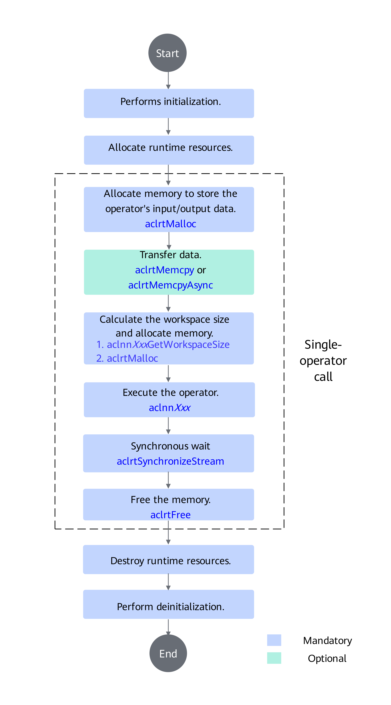
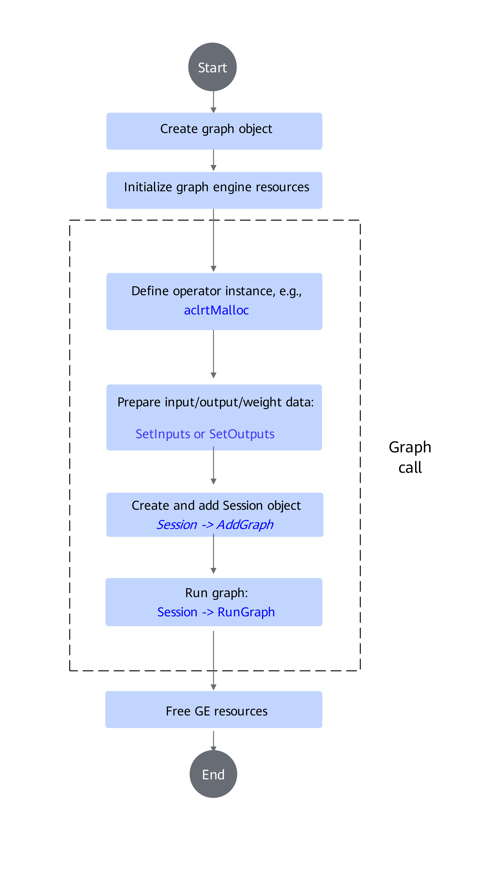

# Operator Invocation Methods

## Overview

Operators can be invoked through multiple methods. This chapter uses the `AddExample` operator invocation as an example to describe the operator invocation and execution process in detail.

> Note: The aclnn interface method is recommended. If this method is not supported, use the graph mode to invoke the operator.

- aclnn invocation **(Recommended)**: Invoke the operator using the aclnnXxx interface (a set of C-based APIs that do not require IR definitions).
- Graph mode invocation: Invoke the operator using the IR (Intermediate Representation) graph construction method.

## aclnn Invocation

### Invocation Process



### Sample Code

The sample code for invoking the `AddExample` operator using the aclnn interface is as follows (for detailed code, refer to [test_aclnn_add_example.cpp](../../../examples/add_example/examples/test_aclnn_add_example.cpp)). This is **for reference only**. The invocation process for other operator interfaces is similar; replace it with the actual aclnn interface. Before invocation, set the environment variables as instructed in the environment installation guide.

Note: To invoke other operators in this project, access the test_aclnn_${op_name}.cpp file in the corresponding operator's `examples` directory, where ${op_name} represents the operator name.

```Cpp
int main()
{
    // 1. Call acl for device/stream initialization
    int32_t deviceId = 0;
    aclrtStream stream;
    auto ret = Init(deviceId, &stream);
    CHECK_RET(ret == ACL_SUCCESS, LOG_PRINT("Init acl failed. ERROR: %d\n", ret); return ret);

    // 2. Construct input and output, which need to be customized based on the API interface
    aclTensor* selfX = nullptr;
    void* selfXDeviceAddr = nullptr;
    std::vector<int64_t> selfXShape = {32, 4, 4, 4};
    std::vector<float> selfXHostData(2048, 1);
    ret = CreateAclTensor(selfXHostData, selfXShape, &selfXDeviceAddr, aclDataType::ACL_FLOAT, &selfX);
    CHECK_RET(ret == ACL_SUCCESS, return ret);

    aclTensor* selfY = nullptr;
    void* selfYDeviceAddr = nullptr;
    std::vector<int64_t> selfYShape = {32, 4, 4, 4};
    std::vector<float> selfYHostData(2048, 1);
    ret = CreateAclTensor(selfYHostData, selfYShape, &selfYDeviceAddr, aclDataType::ACL_FLOAT, &selfY);
    CHECK_RET(ret == ACL_SUCCESS, return ret);

    aclTensor* out = nullptr;
    void* outDeviceAddr = nullptr;
    std::vector<int64_t> outShape = {32, 4, 4, 4};
    std::vector<float> outHostData(2048, 1);
    ret = CreateAclTensor(outHostData, outShape, &outDeviceAddr, aclDataType::ACL_FLOAT, &out);
    CHECK_RET(ret == ACL_SUCCESS, return ret);

    // 3. Call the CANN operator library API; modify to the specific API name
    uint64_t workspaceSize = 0;
    aclOpExecutor* executor;

    // 4. Call the first-stage interface of aclnnAddExample
    ret = aclnnAddExampleGetWorkspaceSize(selfX, selfY, out, &workspaceSize, &executor);
    CHECK_RET(ret == ACL_SUCCESS, LOG_PRINT("aclnnAddExampleGetWorkspaceSize failed. ERROR: %d\n", ret); return ret);

    // Allocate device memory based on the workspaceSize calculated by the first-stage interface
    void* workspaceAddr = nullptr;
    if (workspaceSize > static_cast<uint64_t>(0)) {
        ret = aclrtMalloc(&workspaceAddr, workspaceSize, ACL_MEM_MALLOC_HUGE_FIRST);
        CHECK_RET(ret == ACL_SUCCESS, LOG_PRINT("allocate workspace failed. ERROR: %d\n", ret); return ret);
    }

    // 5. Call the second-stage interface of aclnnAddExample
    ret = aclnnAddExample(workspaceAddr, workspaceSize, executor, stream);
    CHECK_RET(ret == ACL_SUCCESS, LOG_PRINT("aclnnAddExample failed. ERROR: %d\n", ret); return ret);

    // 6. (Fixed pattern) Synchronously wait for the task execution to complete
    ret = aclrtSynchronizeStream(stream);
    CHECK_RET(ret == ACL_SUCCESS, LOG_PRINT("aclrtSynchronizeStream failed. ERROR: %d\n", ret); return ret);

    // 7. Obtain the output value; copy the result from the device side memory to the host side, which needs to be modified based on the specific API interface definition
    PrintOutResult(outShape, &outDeviceAddr);

    // 8. Release aclTensor, which needs to be modified based on the specific API interface definition
    aclDestroyTensor(selfX);
    aclDestroyTensor(selfY);
    aclDestroyTensor(out);

    // 9. Release device resources
    aclrtFree(selfXDeviceAddr);
    aclrtFree(selfYDeviceAddr);
    aclrtFree(outDeviceAddr);
    if (workspaceSize > static_cast<uint64_t>(0)) {
        aclrtFree(workspaceAddr);
    }
    aclrtDestroyStream(stream);
    aclrtResetDevice(deviceId);

    // 10. acl de-initialization
    aclFinalize();
    return 0;
}
```

### Compilation and Running

> Note: For operators already implemented in the project (non-custom operators), you can directly run the operator through the build.sh script in the root directory. For operations, refer to [Local Verification](./quick_op_invocation.md#local-verification).

1. Prerequisites.
   Complete the compilation and deployment of the target operator by following [Source Code Compilation](./quick_op_invocation.md#source-code-compilation) in this project.

2. Create a CMakeLists file.

   Create a CMakeLists file in the same directory as test_aclnn_${op_name}.cpp. The following example uses the `AddExample` operator. Modify it according to your actual situation.

    ```bash
   cmake_minimum_required(VERSION 3.14)
   # Set the project name
   project(ACLNN_EXAMPLE)

   # Set the C++ compilation standard
   add_compile_options(-std=c++11)

   # Set the compilation output directory to the bin folder in the current directory
   set(CMAKE_RUNTIME_OUTPUT_DIRECTORY  "./bin")

   # Set compilation options for debug and release modes
   set(CMAKE_CXX_FLAGS_DEBUG "-fPIC -O0 -g -Wall")
   set(CMAKE_CXX_FLAGS_RELEASE "-fPIC -O2 -Wall")

   # Get the LD_LIBRARY_PATH environment variable
   if(NOT DEFINED ENV{LD_LIBRARY_PATH})
       message(FATAL_ERROR "LD_LIBRARY_PATH environment variable is not set")
   endif()
   set(LD_LIB_PATH "$ENV{LD_LIBRARY_PATH}")

   # Split the path list and find the path containing /vendors/ (only required for custom operators)
   string(REPLACE ":" ";" LD_LIB_LIST "${LD_LIB_PATH}")
   set(TARGET_PATH "")
   foreach(path ${LD_LIB_LIST})
       # Match the path containing /vendors/ (position-independent)
       if(path MATCHES "/vendors/")
           set(TARGET_PATH "${path}")
           break()
       endif()
   endforeach()
   if(NOT TARGET_PATH)
       message(FATAL_ERROR "Path containing /vendors/ not found in LD_LIBRARY_PATH")
   endif()
   if(TARGET_PATH MATCHES "/vendors/([^/]+)")
       set(TARGET_SUBDIR "${CMAKE_MATCH_1}")
   else()
       message(FATAL_ERROR "Direct subdirectory of /vendors/ not found in path ${TARGET_PATH}")
   endif()

   # Add executable file (replace with the actual operator executable file), specifying the *.cpp file for operator invocation
   add_executable(test_aclnn_add_example
   test_aclnn_add_example.cpp)

   # ASCEND_PATH (CANN software package directory, modify according to the actual path)
   if(NOT "$ENV{ASCEND_HOME_PATH}" STREQUAL "")
       set(ASCEND_PATH $ENV{ASCEND_HOME_PATH})
   else()
       set(ASCEND_PATH "/usr/local/Ascend/cann")
   endif()

   # Set header file paths
   set(INCLUDE_BASE_DIR "${ASCEND_PATH}/include")
   include_directories(
       ${INCLUDE_BASE_DIR}
       ${ASCEND_PATH}/opp/vendors/${TARGET_SUBDIR}/op_api/include        # Only required for custom operators
       # ${INCLUDE_BASE_DIR}/aclnn                                   # Only required for built-in operators
   )
   include_directories(
       ${INCLUDE_BASE_DIR}
   )

   # Link the required dynamic libraries
   target_link_libraries(test_aclnn_add_example PRIVATE             # Replace with the actual operator executable file
       ${ASCEND_PATH}/lib64/libascendcl.so
       ${ASCEND_PATH}/lib64/libnnopbase.so
       ${ASCEND_PATH}/opp/vendors/${TARGET_SUBDIR}/op_api/lib/libcust_opapi.so   # Only required for custom operators
       # ${ASCEND_PATH}/lib64/libopapi_nn.so    # Only required for built-in operators
   )

   # Install the target file to the bin directory
   install(TARGETS test_aclnn_add_example DESTINATION ${CMAKE_RUNTIME_OUTPUT_DIRECTORY})
    ```

3. Create a run.sh file.

    Create a run.sh file in the same directory as test_aclnn_${op_name}.cpp. The following example uses the `AddExample` operator. Modify it according to your actual situation.

    ```bash
    if [ -n "$ASCEND_INSTALL_PATH" ]; then
        _ASCEND_INSTALL_PATH=$ASCEND_INSTALL_PATH
    elif [ -n "$ASCEND_HOME_PATH" ]; then
        _ASCEND_INSTALL_PATH=$ASCEND_HOME_PATH
    else
        _ASCEND_INSTALL_PATH="/usr/local/Ascend/cann"
    fi

    source ${_ASCEND_INSTALL_PATH}/bin/setenv.bash

    rm -rf build
    mkdir -p build
    cd build
    cmake ../ -DCMAKE_CXX_COMPILER=g++ -DCMAKE_SKIP_RPATH=TRUE
    make
    cd bin
    ./test_aclnn_add_example            # Replace with the actual operator executable file name
    ```

4. Run the run.sh file.
    Execute the following command in the directory where the run.sh file is located:

   ```bash
   bash run.sh
   ```

    By default, the executable file test_aclnn_add_example is generated in the current execution path `/build/bin`. The running result is as follows:

   ```text
   mean result[2046] is 2.000000
   mean result[2047] is 2.000000
   ```

## Graph Mode Invocation

### Invocation Process



### Sample Code

The sample code for invoking the `AddExample` operator using the graph mode is as follows (for detailed code, refer to [test_geir_add_example.cpp](../../../examples/add_example/examples/test_geir_add_example.cpp)). This is **for reference only**. The invocation process for other operators is similar; replace it with the actual operator prototype.

To invoke other operators in this project, access the test_geir_${op_name}.cpp file in the corresponding operator's `examples` directory, where ${op_name} represents the operator name.

```CPP
int main() {
    // 1. Create a graph object
    Graph graph(graphName);

    // 2. Initialize global compilation options for the graph
    Status ret = ge::GEInitialize(globalOptions);

    // 3. Create an AddExample operator instance
    auto add1 = op::AddExample("add1");

    // 4. Define the graph input and output vectors
    std::vector<Operator> inputs{};
    std::vector<Operator> outputs{};

    // 5. Prepare input data
    std::vector<int64_t> xShape = {32,4,4,4};
    // Use macro expansion to handle variable assignment
    ADD_INPUT(1, x1, inDtype, xShape);
    ADD_INPUT(2, x2, inDtype, xShape);
    ADD_OUTPUT(1, y, inDtype, xShape);

    outputs.push_back(add1);

    // 6. Set the input and output operators for the graph object
    graph.SetInputs(inputs).SetOutputs(outputs);

    // 7. Create a session object
    ge::Session* session = new Session(buildOptions);

    // 8. Add the graph to the session
    ret = session->AddGraph(graphId, graph, graphOptions);

    // 9. Run the graph
    ret = session->RunGraph(graphId, input, output);

    // 10. Release resources
    GEFinalize();

    return 0;
}
```

### Compilation and Running

> Note: For operators already implemented in the project (non-custom operators), you can directly run the operator through the build.sh script in the root directory. For operations, refer to [Local Verification](./quick_op_invocation.md#local-verification).

1. Prerequisites.
   Complete the compilation and deployment of the target operator by following [Source Code Compilation](./quick_op_invocation.md#source-code-compilation) in this project.

2. Create a CMakeLists file.

   Create a CMakeLists file in the same directory as test_geir_${op_name}.cpp. The following example uses the `AddExample` operator. Modify it according to your actual situation.

    ```bash
   cmake_minimum_required(VERSION 3.14)

   # Set the project name
   project(GE_IR_EXAMPLE)

   # Set the compilation output directory to the bin folder in the current directory
   set(CMAKE_RUNTIME_OUTPUT_DIRECTORY "./bin")

   if(NOT "$ENV{ASCEND_OPP_PATH}" STREQUAL "")
       get_filename_component(ASCEND_PATH $ENV{ASCEND_OPP_PATH} DIRECTORY)
   elseif(NOT "$ENV{ASCEND_HOME_PATH}" STREQUAL "")
       set(ASCEND_PATH $ENV{ASCEND_HOME_PATH})
   else()
       set(ASCEND_PATH "/usr/local/Ascend/cann")
   endif()

   set(FWK_INCLUDE_DIR "${ASCEND_PATH}/compiler/include")

   message(STATUS "ASCEND_PATH: ${ASCEND_PATH}")

   file(GLOB files CONFIGURE_DEPENDS
        test_geir_add_example.cpp
   )

   # Add executable file (replace with the actual operator executable file)
   add_executable(test_geir_add_example ${files})

   find_library(GRAPH_LIBRARY_DIR libgraph.so "${ASCEND_PATH}/lib64")
   find_library(GE_RUNNER_LIBRARY_DIR libge_runner.so "${ASCEND_PATH}/lib64")
   find_library(GRAPH_BASE_LIBRARY_DIR libgraph_base.so "${ASCEND_PATH}/lib64")
   find_library(GE_COMPILER_DIR libge_compiler.so "${ASCEND_PATH}/lib64")

   # Link the required dynamic libraries
   target_link_libraries(test_geir_add_example PRIVATE
        ${GRAPH_LIBRARY_DIR}
        ${GE_RUNNER_LIBRARY_DIR}
        ${GRAPH_BASE_LIBRARY_DIR}
        ${GE_COMPILER_DIR}
   )

   # Set header file paths
   target_include_directories(test_geir_add_example PRIVATE
        ${FWK_INCLUDE_DIR}/graph/
        ${FWK_INCLUDE_DIR}/ge/
        ${ASCEND_PATH}/opp/built-in/op_proto/inc/
        ${CMAKE_CURRENT_SOURCE_DIR}
        ${ASCEND_PATH}/compiler/include
        ${ASCEND_PATH}/include/graph/
        ${ASCEND_PATH}/include/ge/
        ${ASCEND_PATH}/include/
   )

   # Install the target file to the bin directory
   install(TARGETS test_geir_add_example DESTINATION ${CMAKE_RUNTIME_OUTPUT_DIRECTORY})
    ```

3. Create a run.sh script.

   Create a run.sh file in the same directory as test_geir_${op_name}.cpp. The following example uses the `AddExample` operator. Modify it according to your actual situation.

    ```bash
    if [ -n "$ASCEND_INSTALL_PATH" ]; then
        _ASCEND_INSTALL_PATH=$ASCEND_INSTALL_PATH
    elif [ -n "$ASCEND_HOME_PATH" ]; then
        _ASCEND_INSTALL_PATH=$ASCEND_HOME_PATH
    else
        _ASCEND_INSTALL_PATH="/usr/local/Ascend/cann"
    fi

    source ${_ASCEND_INSTALL_PATH}/bin/setenv.bash

    rm -rf build
    mkdir -p build
    cd build
    cmake ../ -DCMAKE_CXX_COMPILER=g++ -DCMAKE_SKIP_RPATH=TRUE
    make
    cd bin
    ./test_geir_add_example                  # Replace with the actual operator executable file name
    ```

4. Run the run.sh script.
    Execute the following command in the directory where the run.sh file is located:

    ```bash
    bash run.sh
    ```

    By default, the executable file test_geir_add_example is generated in the current execution path `/build/bin`. The running result is as follows:

    ```text
    INFO - [XIR]: Finalize ir graph session success
    ```
